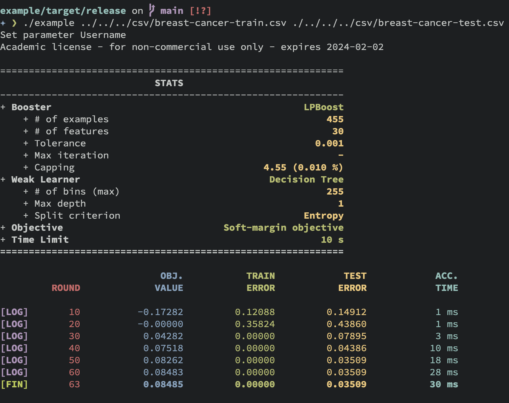

 


[Documentation][miniboosts]

*MiniBoosts* is a library for boosting algorithm developers.  
Boosting is a repeated game between a *Booster* and a *Weak Learner*.

For each round of the game,
1. The *Booster* chooses a distribution over training examples,
2. Then the *Weak Learner* chooses a hypothesis (function)
   whose accuracy w.r.t. the distribution is 
   slightly better than random guessing.

After sufficient rounds, the *Booster* outputs a hypothesis
that performs significantly better on training examples.

Some *Booster* need to enable `extended` flag in `Cargo.toml` like this:  
```toml
minibosts = { version = "0.3.3", features = ["extended"] }
```
These boosting algorithms use [Gurobi][gurobi] to compute 
a distribution over training examples.
Thanks to Gurobi, 
you can use the `extended` feature for free if you are a student.

|`BOOSTER`                                                                                             | `FEATURE FLAG` |
| :---                                                                                                 | :---           |
| [AdaBoost][adaboost]<br>by Freund and Schapire, 1997                                                 |                |
| [GBM][gbm] (Gradient Boosting Machine),<br>by Jerome H. Friedman, 2001                               |                |
| [LPBoost][lpboost]<br>by Demiriz, Bennett, and Shawe-Taylor, 2002                                    |   `extended`   |
| [SmoothBoost][smoothboost]<br>by Servedio, 2003                                             |                |
| [AdaBoostV][adaboostv]<br>by Rätsch and Warmuth, 2005                                                |                |
| [TotalBoost][totalboost]<br>by Warmuth, Liao, and Rätsch, 2006                                       |   `extended`   |
| [SoftBoost][softboost]<br>by Warmuth, Glocer, and Rätsch, 2007                                       |   `extended`   |
| [ERLPBoost][erlpboost]<br>by Warmuth and Glocer, and Vishwanathan, 2008                              |   `extended`   |
| [CERLPBoost][cerlpboost] (Corrective ERLPBoost)<br>by Shalev-Shwartz and Singer, 2010                |   `extended`   |
| [MLPBoost][mlpboost]<br>by Mitsuboshi, Hatano, and Takimoto, 2022                                    |   `extended`   |
| [GraphSepBoost][graphsepboost] (Graph Separation Boosting)<br>by Alon, Gonen, Hazan, and Moran, 2023 |                |


If you invent a new boosting algorithm,
you can introduce it by implementing `Booster` trait.
See `cargo doc -F extended --open` for details.


Currently, no weak learners use [Gurobi][gurobi].
So, you can use all weak learners without enabling `extended` flag.

|`WEAK LEARNER`                                           |
| :---                                                    |
| [Decision Tree][decisiontree]                           |
| [Regression Tree][regressiontree]                       |
| [A worst-case weak learner for LPBoost][badbaselearner] |
| Gaussian Naive Bayes                                    |
| Neural Network (Experimental)                           |


## Why *MiniBoosts*?
If you write a paper about boosting algorithms, 
you need to compare your algorithm against others.
At this point, some issues arise.
- Some boosting algorithms, 
  such as [*LightGBM*][lightgbm] or [*XGBoost*][xgboost], 
  are implemented and available for free.
  These are very easy to use in Python3 but hard to compare to other algorithms
  since they are implemented in C++ internally.
  Implementing your algorithm in Python3
  makes the running time comparison unfair 
  (Python3 is significantly slow compared to C++).
  However, implementing it in C++ is extremely hard (based on my experience).
- Most boosting algorithms are designed 
  for a decision-tree weak learner 
  even though the boosting protocol does not demand.
- There is no implementation for margin optimization boosting algorithms. 
  Margin optimization is a better goal than empirical risk minimization 
  in binary classification.


*MiniBoosts* is a crate to address the above issues.  
This crate provides the followings.
- Two main traits, named `Booster` and `WeakLearner.`
  - If you invent a new Boosting algorithm, 
    all you need is to implement `Booster.`
  - If you invent a new Weak Learning algorithm, 
    all you need is to implement `WeakLearner.`
- Some famous boosting algorithms, 
  including [*AdaBoost*][adaboost], 
  [*LPBoost*][lpboost], 
  [*ERLPBoost*][erlpboost], etc.
- Some weak learners, including Decision-Tree, Regression-Tree, etc.


## *MiniBoosts* for reasearch
Sometimes, one wants to log each step of boosting procedure.
You can use `Logger` struct to output log to `.csv` file,
while printing the status like this:



See [Research feature](#research-feature) section for detail.


## How to use
[Documentation][miniboosts]

Write the following to `Cargo.toml`.
```TOML
miniboosts = { version = "0.3.3" }
```

If you want to use `extended` features, enable the flag:
```TOML
miniboosts = { version = "0.3.3", features = ["extended"] }
```

Here is a sample code:
```rust
use miniboosts::prelude::*;


fn main() {
    // Set file name
    let file = "/path/to/input/data.csv";

    // Read the CSV file
    // The column named `class` corresponds to the labels (targets).
    let sample = SampleReader::new()
        .file(file)
        .has_header(true)
        .target_feature("class")
        .read()
        .unwrap();


    // Set tolerance parameter as `0.01`.
    let tol: f64 = 0.01;


    // Initialize Booster
    let mut booster = AdaBoost::init(&sample)
        .tolerance(tol); // Set the tolerance parameter.


    // Construct `DecisionTree` Weak Learner from `DecisionTreeBuilder`.
    let weak_learner = DecisionTreeBuilder::new(&sample)
        .max_depth(3) // Specify the max depth (default is 2)
        .criterion(Criterion::Twoing) // Choose the split rule.
        .build(); // Build `DecisionTree`.


    // Run the boosting algorithm
    // Each booster returns a combined hypothesis.
    let f = booster.run(&weak_learner);


    // Get the batch prediction for all examples in `data`.
    let predictions = f.predict_all(&sample);


    // You can predict the `i`th instance.
    let i = 0_usize;
    let prediction = f.predict(&sample, i);

    // You can convert the hypothesis `f` to `String`.
    let s = serde_json::to_string(&f);
}
```


If you use boosting for soft margin optimization, 
initialize booster like this:
```rust
let n_sample = sample.shape().0; // Get the number of training examples
let nu = n_sample as f64 * 0.2; // Set the upper-bound of the number of outliers.
let lpboost = LPBoost::init(&sample)
    .tolerance(tol)
    .nu(nu); // Set a capping parameter.
```
Note that the capping parameter must satisfies `1 <= nu && nu <= n_sample`.


## Research feature
This crate can output a CSV file for such values in each step.

Here is an example:
```rust
use miniboosts::prelude::*;
use miniboosts::{
    Logger,
    LoggerBuilder,
    SoftMarginObjective,
};


// Define a loss function
fn zero_one_loss<H>(sample: &Sample, f: &H) -> f64
    where H: Classifier
{
    let n_sample = sample.shape().0 as f64;

    let target = sample.target();

    f.predict_all(sample)
        .into_iter()
        .zip(target.into_iter())
        .map(|(fx, &y)| if fx != y as i64 { 1.0 } else { 0.0 })
        .sum::<f64>()
        / n_sample
}


fn main() {
    // Read the training data
    let path = "/path/to/train/data.csv";
    let train = SampleReader::new()
        .file(path)
        .has_header(true)
        .target_feature("class")
        .read()
        .unwrap();

    // Set some parameters used later.
    let n_sample = train.shape().0 as f64;
    let nu = 0.01 * n_sample;


    // Read the test data
    let path = "/path/to/test/data.csv";
    let test = SampleReader::new()
        .file(path)
        .has_header(true)
        .target_feature("class")
        .read()
        .unwrap();


    let booster = LPBoost::init(&train)
        .tolerance(0.01)
        .nu(nu);

    let weak_learner = DecisionTreeBuilder::new(&train)
        .max_depth(2)
        .criterion(Criterion::Entropy)
        .build();

    // Set the objective function.
    // One can use your own function by implementing ObjectiveFunction trait.
    let objective = SoftMarginObjective::new(nu);

    let mut logger = LoggerBuilder::new()
        .booster(booster)
        .weak_learner(tree)
        .train_sample(&train)
        .test_sample(&test)
        .objective_function(objective)
        .loss_function(zero_one_loss)
        .time_limit_as_secs(120) // Terminate after 120 seconds
        .print_every(10)         // Print log every 10 rounds.
        .build();

    // Each line of `lpboost.csv` contains the following four information:
    // Objective value, Train loss, Test loss, Time per iteration
    // The returned value `f` is the combined hypothesis.
    let f = logger.run("logfile.csv")
        .expect("Failed to logging");
}
```

## Others
- Currently, this crate mainly supports 
  boosting algorithms for binary classification.
- Some boosting algorithms use [Gurobi optimizer][gurobi], 
  so you must acquire a license to use this library. 
  If you have the license, you can use these boosting algorithms (boosters) 
  by specifying `features = ["extended"]` in `Cargo.toml`.
  The compilation fails 
  if you try to use the extended feature without a Gurobi license.
- One can log your algorithm by implementing `Research` trait.
- Run `cargo doc -F extended --open` to see more information.
- `GraphSepBoost` only supports the aggregation rule 
  shown in Lemma 4.2 of their paper.


## Future work

- Boosters
    - [AnyBoost][anyboost]
    - [SparsiBoost][sparsiboost]
    - [LogitBoost][logitboost]
    - [AdaBoost.L][adaboostl]
    - [Branching Program][branching]


- Weak Learners
    - Bag of words
    - TF-IDF
    - [RBF-Net](https://link.springer.com/content/pdf/10.1023/A:1007618119488.pdf)


- Others
    - Parallelization
    - LP/QP solver (This work allows you to use `extended` features without a license).


[adaboost]: https://www.sciencedirect.com/science/article/pii/S002200009791504X?via%3Dihub
[adaboostl]: https://link.springer.com/article/10.1023/A:1013912006537
[adaboostv]: http://jmlr.org/papers/v6/ratsch05a.html
[anyboost]: https://www.researchgate.net/publication/243689632_Functional_gradient_techniques_for_combining_hypotheses
[badbaselearner]: https://papers.nips.cc/paper_files/paper/2007/hash/cfbce4c1d7c425baf21d6b6f2babe6be-Abstract.html
[branching]: https://www.sciencedirect.com/science/article/pii/S0022000001917969
[cerlpboost]: https://link.springer.com/article/10.1007/s10994-010-5173-z
[decisiontree]: https://www.amazon.co.jp/-/en/Leo-Breiman/dp/0412048418
[erlpboost]: https://www.stat.purdue.edu/~vishy/papers/WarGloVis08.pdf
[gbm]: https://projecteuclid.org/journals/annals-of-statistics/volume-29/issue-5/Greedy-function-approximation-A-gradient-boostingmachine/10.1214/aos/1013203451.full
[gurobi]: https://www.gurobi.com
[graphsepboost]: https://theoretics.episciences.org/10757
[lightgbm]: https://github.com/microsoft/LightGBM
[logitboost]: https://projecteuclid.org/journals/annals-of-statistics/volume-28/issue-2/Additive-logistic-regression--a-statistical-view-of-boosting-With/10.1214/aos/1016218223.full
[lpboost]: https://link.springer.com/content/pdf/10.1023/A:1012470815092.pdf
[smoothboost]: https://link.springer.com/chapter/10.1007/3-540-44581-1_31
[softboost]: https://proceedings.neurips.cc/paper/2007/file/cfbce4c1d7c425baf21d6b6f2babe6be-Paper.pdf
[totalboost]: https://dl.acm.org/doi/10.1145/1143844.1143970
[mlpboost]: https://arxiv.org/abs/2209.10831
[regressiontree]: https://www.amazon.co.jp/-/en/Leo-Breiman/dp/0412048418
[sparsiboost]: http://proceedings.mlr.press/v97/mathiasen19a/mathiasen19a.pdf
[xgboost]: https://github.com/dmlc/xgboost

[miniboosts]: https://docs.rs/miniboosts/latest/miniboosts/
